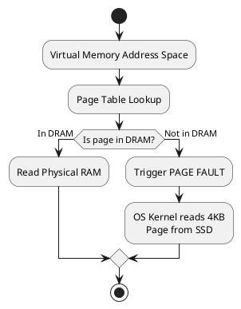
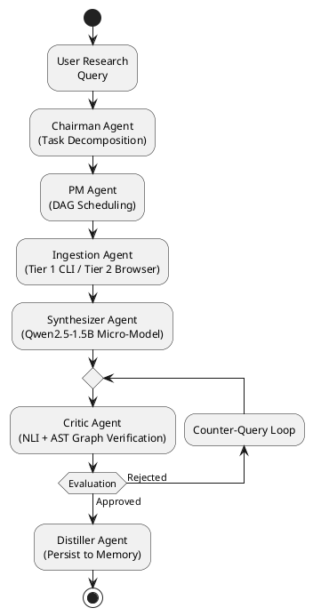

# YORD: The 12M-Token Pure-Local Autonomous Research Harness
## Definitive Systems Architecture, Mathematical Foundations, and Reverse-Engineering Manual

---

# TABLE OF CONTENTS & NAVIGATION ROADMAP

- [CHAPTER 1: The Hardware Ceiling & The 12M Context Crisis](#chapter-1-the-hardware-ceiling--the-12m-context-crisis)
- [CHAPTER 2: Vector Spaces & The Geometry of Meaning](#chapter-2-vector-spaces--the-geometry-of-meaning)
- [CHAPTER 3: Self-Attention & Vector Search Mechanics](#chapter-3-self-attention--vector-search-mechanics)
- [CHAPTER 4: Virtual Memory & SSD Vector MMap Physics](#chapter-4-virtual-memory--ssd-vector-mmap-physics)
- [CHAPTER 5: AST Structural Parsing & Graphify Fast-Path Pre-Filtering](#chapter-5-ast-structural-parsing--graphify-fast-path-pre-filtering)
- [CHAPTER 6: Multi-Agent Logic Orchestration & State Machine Architecture](#chapter-6-multi-agent-logic-orchestration--state-machine-architecture)
- [CHAPTER 7: Non-Sycophantic Adversarial Critique & NLI Physics](#chapter-7-non-sycophantic-adversarial-critique--nli-physics)
- [CHAPTER 8: Quantum Consensus Engine & State Vector Collapse](#chapter-8-quantum-consensus-engine--state-vector-collapse)
- [CHAPTER 9: Speculative Decoding: The Draft-and-Verify Speed Hack](#chapter-9-speculative-decoding-the-draft-and-verify-speed-hack)
- [CHAPTER 10: Five Domain Case Studies](#chapter-10-five-domain-case-studies)
- [CHAPTER 11: The YORD Technology Stack & Component Rationale](#chapter-11-the-yord-technology-stack--component-rationale)
- [CHAPTER 12: Reverse-Engineering Blueprint & Reference Code](#chapter-12-reverse-engineering-blueprint--reference-code)
- [CHAPTER 13: Advanced Optimization & Systems Diagnostics Guide](#chapter-13-advanced-optimization--systems-diagnostics-guide)
- [CHAPTER 14: Full System Dry Run: Performance on Substandard Hardware](#chapter-14-full-system-dry-run-performance-on-substandard-hardware)
- [BACK MATTER: Technical Glossary & Index of Symbols](#back-matter-technical-glossary--index-of-symbols)

---

# CHAPTER 1: The Hardware Ceiling & The 12M Context Crisis

> [!NOTE]
> **Concept Motive**: Understand why processing 12 million tokens locally breaks standard hardware architecture, and how hardware constraints dictate software design.

### 1.1 The Motivating Problem: Why Local AI Hits a Memory Wall

Consider a researcher studying nanomaterial synthesis or auditing a 100,000-line codebase. The dataset contains 12,000,000 text tokens (roughly 48 megabytes of raw text). 

If we attempt to feed all 12 million tokens directly into a modern Large Language Model (LLM) using standard Dense Attention, the system crashes immediately. Why?

To answer this, we calculate the RAM required to store the self-attention matrix. Self-attention compares every token to every other token. For $N$ tokens, the attention matrix contains $N \times N = N^2$ values.

When $N = 12,000,000$:

```math
N^2 = (12 \times 10^6)^2 = 144 \times 10^{12} \text{ elements} = 144 \text{ trillion elements}
```

If each element is stored as a 2-byte half-precision float (`fp16`):

```math
\text{Memory} = 144 \times 10^{12} \times 2 \text{ bytes} = 288 \text{ Terabytes (TB)}
```

No consumer computer possesses 288 Terabytes of High-Bandwidth GPU RAM (VRAM). Even a top-tier MacBook Pro maxes out at 128 Gigabytes of RAM.

> [!IMPORTANT]
> **System Bottleneck**: Dense Attention scales quadratically ( $O(N^2)$ ) in memory. Processing 12 million tokens simultaneously in VRAM is physically impossible on consumer hardware.

---

### 1.2 The DRAM Bandwidth Ceiling

Even if we fit the model weights into system RAM (DRAM), we encounter a second hardware wall: **Memory Bandwidth**.

During token generation, the CPU must read every weight parameter from DRAM into the CPU cache for *every single generated token*.

Let's measure the maximum possible token generation speed on a typical laptop with dual-channel DDR4 memory providing $45 \text{ GB/s}$ bandwidth.

#### Worked Example 1.1: Token Speed Calculation

**Problem**: A student runs an 8-billion parameter model (`fp16`, requiring 16 GB for weights and 4 GB for KV cache = 20 GB total memory access per token). Calculate the theoretical maximum speed.

**Calculation**:

```math
\text{Generation Speed} = \frac{\text{Memory Bandwidth}}{\text{Bytes per Token}} = \frac{45 \text{ GB/s}}{20 \text{ GB/token}} = 2.25 \text{ tokens/sec}
```

If the system runs low on RAM and begins swapping data to disk (page thrashing), speed collapses from $2.25 \text{ tokens/sec}$ to **$0.05 \text{ tokens/sec}$**, making the system unusable.

---

### 1.3 The YORD Non-Negotiable Core Constraints

To make deep research accessible to students and researchers without expensive cloud accounts, YORD operates under six non-negotiable architectural principles:

1. **100% PRIVATE**: 0 external network calls. All data remains on the local disk.
2. **100% FREE**: $0 API subscription fees. Uses open-weights micro-models.
3. **SUBSTANDARD SYSTEM TARGET**: Native execution on Intel i5 CPUs with 8GB RAM.
4. **RIGOROUS FACT CITATION**: Every claim is linked to exact source file byte offsets.
5. **ZERO SYCOPHANCY**: Uses decoupled NLI cross-encoders to reject false user assumptions.
6. **12M TOKEN CONTEXT**: Achieved via disk-mapped vector search + AST pre-filtering.

> [!TIP]
> **Key Insight**: Instead of feeding 12M tokens into an LLM at once, YORD uses disk-mapped vector search and AST filtering to retrieve only the top 20 relevant chunks ($\approx 10,000$ tokens), feeding them into a 1.5B micro-model using 700MB RAM.

---

### Exercises & Step-by-Step Answer Key

#### Level 1: Intuition

1. **Question**: Why does doubling the input context length quadruples the memory required for dense self-attention?
   - *Answer Key*: Dense attention computes an $N \times N$ matrix. If $N \to 2N$, $(2N)^2 = 4N^2$, which requires $4 \times$ the memory.

#### Level 2: Calculation

2. **Question**: Calculate the memory required for a dense attention matrix with $N = 100,000$ tokens using 4-byte `fp32` floats.
   - *Answer Key*: $100,000^2 = 10^{10}$ elements. $10^{10} \times 4 \text{ bytes} = 40,000,000,000 \text{ bytes} = 40 \text{ GB}$.

#### Level 3: Systems Implementation

3. **Question**: Write a Python function to estimate DRAM token generation speed given model size (in GB) and DRAM bandwidth (in GB/s).
   - *Answer Key*:
     ```python
     def max_token_speed(model_size_gb: float, dram_bw_gbs: float) -> float:
         return dram_bw_gbs / model_size_gb
     ```

---

# CHAPTER 2: Vector Spaces & The Geometry of Meaning

> [!NOTE]
> **Concept Motive**: Learn how text is converted into multi-dimensional geometry, how directional angles measure meaning, and why unit normalization simplifies vector distance math.

### 2.1 Representing Concepts as Vectors

A vector $\mathbf{v}$ is an ordered list of real numbers representing a point in space. In text processing, an embedding model maps a text passage into a $d$-dimensional vector:

```math
\mathbf{v} = [v_1, v_2, \dots, v_d]^T \in \mathbb{R}^d
```

For example, the model BGE-M3 maps any sentence into a $d = 768$ dimensional vector. Concepts with similar meanings are placed close together in this space.

---

### 2.2 Vector Norms & Dot Products

To measure the length of a vector $\mathbf{v} \in \mathbb{R}^d$, we use the **Euclidean ($L_2$) Norm**:

```math
\|\mathbf{v}\|_2 = \sqrt{\sum_{i=1}^d v_i^2}
```

A vector is **unit-normalized** when its length equals $1.0$:

```math
\hat{\mathbf{v}} = \frac{\mathbf{v}}{\|\mathbf{v}\|_2}
```

The **dot product** (inner product) between two vectors $\mathbf{u}$ and $\mathbf{v}$ measures their geometric alignment:

```math
\mathbf{u} \cdot \mathbf{v} = \sum_{i=1}^d u_i v_i = \|\mathbf{u}\|_2 \|\mathbf{v}\|_2 \cos(\theta)
```

where $\theta$ is the angle between the two vectors.

---

### 2.3 Cosine Similarity vs Euclidean Distance

The **Cosine Similarity** measures the angle between two concepts regardless of magnitude:

```math
\text{Sim}_{\text{cos}}(\mathbf{u}, \mathbf{v}) = \frac{\mathbf{u} \cdot \mathbf{v}}{\|\mathbf{u}\|_2 \|\mathbf{v}\|_2} = \cos(\theta)
```

- If $\cos(\theta) = 1.0$, the vectors point in the exact same direction (identical meaning).
- If $\cos(\theta) = 0.0$, the vectors are orthogonal (unrelated).
- If $\cos(\theta) = -1.0$, the vectors point in opposite directions.

> [!TIP]
> **Mathematical Shortcut**: When vectors are unit-normalized ( $\|\hat{\mathbf{u}}\|_2 = \|\hat{\mathbf{v}}\|_2 = 1.0$ ), Cosine Similarity equals the simple dot product:
> 
> ```math
> \text{Sim}_{\text{cos}}(\hat{\mathbf{u}}, \hat{\mathbf{v}}) = \hat{\mathbf{u}} \cdot \hat{\mathbf{v}}
> ```

#### Worked Example 2.1: 2D Vector Geometry

**Problem**: Given two 2D vectors $\mathbf{u} = [3, 4]^T$ and $\mathbf{v} = [4, 0]^T$:

1. Calculate their $L_2$ norms.
2. Normalize both vectors to unit length.
3. Calculate their Cosine Similarity.

**Step-by-Step Solution**:

1. Calculate Norms:
   
   ```math
   \|\mathbf{u}\|_2 = \sqrt{3^2 + 4^2} = \sqrt{9 + 16} = \sqrt{25} = 5.0
   ```
   
   ```math
   \|\mathbf{v}\|_2 = \sqrt{4^2 + 0^2} = \sqrt{16} = 4.0
   ```

2. Unit Normalization:
   
   ```math
   \hat{\mathbf{u}} = \left[\frac{3}{5}, \frac{4}{5}\right]^T = [0.6, 0.8]^T
   ```
   
   ```math
   \hat{\mathbf{v}} = \left[\frac{4}{4}, \frac{0}{4}\right]^T = [1.0, 0.0]^T
   ```

3. Cosine Similarity:
   
   ```math
   \text{Sim}_{\text{cos}}(\mathbf{u}, \mathbf{v}) = \hat{\mathbf{u}} \cdot \hat{\mathbf{v}} = (0.6 \times 1.0) + (0.8 \times 0.0) = 0.60
   ```
   
   ```math
   \theta = \arccos(0.60) = 0.927 \text{ radians} \approx 53.13^\circ
   ```

---

### Exercises & Step-by-Step Answer Key

#### Level 1: Intuition

1. **Question**: Why does unit-normalizing vectors allow us to replace slow Cosine Similarity formulas with fast dot products?
   - *Answer Key*: Because when $\|\mathbf{u}\|_2 = \|\mathbf{v}\|_2 = 1.0$, the denominator in $\frac{\mathbf{u} \cdot \mathbf{v}}{\|\mathbf{u}\|_2 \|\mathbf{v}\|_2}$ becomes $1.0$, leaving just $\mathbf{u} \cdot \mathbf{v}$.

#### Level 2: Calculation

2. **Question**: Compute the dot product of $\mathbf{a} = [0.6, 0.8]^T$ and $\mathbf{b} = [0.8, -0.6]^T$. Are they orthogonal?
   - *Answer Key*: $\mathbf{a} \cdot \mathbf{b} = (0.6 \times 0.8) + (0.8 \times -0.6) = 0.48 - 0.48 = 0.0$. Yes, they are orthogonal ($90^\circ$).

#### Level 3: Systems Implementation

3. **Question**: Write a C++ function to compute the unit normalization of a 768-element `std::vector<float>` in-place.
   - *Answer Key*:
     ```cpp
     #include <vector>
     #include <cmath>

     void normalize_in_place(std::vector<float>& vec) {
         float sum_sq = 0.0f;
         for (float x : vec) sum_sq += x * x;
         float norm = std::sqrt(sum_sq);
         if (norm > 1e-9f) {
             for (float& x : vec) x /= norm;
         }
     }
     ```

---

# CHAPTER 3: Self-Attention & Vector Search Mechanics

> [!NOTE]
> **Concept Motive**: Master the mathematical mechanics of scaled dot-product attention, derive why $\sqrt{d_k}$ variance scaling is necessary, and explore HNSW vector search graphs.

### 3.1 Scaled Dot-Product Attention

The Self-Attention operator takes three matrices—Query ($Q$), Key ($K$), and Value ($V$)—and computes weighted combinations:

```math
\text{Attention}(Q, K, V) = \text{Softmax}\left(\frac{Q K^T}{\sqrt{d_k}}\right) V
```

- $Q \in \mathbb{R}^{N \times d_k}$: Matrix of queries.
- $K \in \mathbb{R}^{N \times d_k}$: Matrix of keys.
- $V \in \mathbb{R}^{N \times d_v}$: Matrix of values.
- $d_k$: Scaling dimension.

---

### 3.2 Derivation of the $\sqrt{d_k}$ Variance Scaling Factor

Why do we divide $Q K^T$ by $\sqrt{d_k}$? 

Let $q_i$ and $k_i$ be independent random variables with zero mean ($\mathbb{E}[q_i] = \mathbb{E}[k_i] = 0$) and unit variance ($\text{Var}(q_i) = \text{Var}(k_i) = 1.0$).

Consider their dot product $y = \mathbf{q} \cdot \mathbf{k} = \sum_{i=1}^{d_k} q_i k_i$:

1. **Mean of Product**:
   
   ```math
   \mathbb{E}[q_i k_i] = \mathbb{E}[q_i] \mathbb{E}[k_i] = 0 \times 0 = 0
   ```
   
   ```math
   \mathbb{E}[y] = \sum_{i=1}^{d_k} 0 = 0
   ```

2. **Variance of Product**:
   
   ```math
   \text{Var}(q_i k_i) = \mathbb{E}[q_i^2 k_i^2] - (\mathbb{E}[q_i k_i])^2 = \mathbb{E}[q_i^2] \mathbb{E}[k_i^2] - 0 = (1.0) \times (1.0) = 1.0
   ```

3. **Variance of Sum**:
   
   ```math
   \text{Var}(y) = \text{Var}\left(\sum_{i=1}^{d_k} q_i k_i\right) = \sum_{i=1}^{d_k} \text{Var}(q_i k_i) = d_k
   ```

The variance of the dot product is $d_k$, meaning its standard deviation is $\sqrt{d_k}$. For large $d_k$ (e.g. $d_k = 128$), dot products become extremely large, pushing the `Softmax` function into regions with tiny gradients (vanishing gradient problem).

Dividing by $\sqrt{d_k}$ normalizes the variance back to $1.0$:

```math
\text{Var}\left(\frac{y}{\sqrt{d_k}}\right) = \frac{\text{Var}(y)}{d_k} = \frac{d_k}{d_k} = 1.0
```

---

#### Worked Example 3.1: 2D Attention Calculation

**Problem**: Given a query $\mathbf{q} = [1.0, 2.0]^T$, keys
```math
K = \begin{bmatrix} 2.0 & 0.0 \\ 1.0 & 3.0 \end{bmatrix}
```
and values
```math
V = \begin{bmatrix} 4.0 & 1.0 \\ 0.0 & 2.0 \end{bmatrix}
```
with $d_k = 2$:

1. Compute raw dot products $\mathbf{q} K^T$.
2. Divide by $\sqrt{d_k} = \sqrt{2} \approx 1.414$.
3. Compute Softmax weights.
4. Calculate final output vector.

**Step-by-Step Solution**:

1. Raw Dot Products:
   
   ```math
   \mathbf{q} K^T = [(1\times 2 + 2\times 0), (1\times 1 + 2\times 3)] = [2.0, 7.0]
   ```

2. Scale by $\sqrt{2}$:
   
   ```math
   \mathbf{s} = \left[\frac{2.0}{1.414}, \frac{7.0}{1.414}\right] = [1.414, 4.950]
   ```

3. Softmax Weights:
   
   ```math
   e^{1.414} \approx 4.112, \quad e^{4.950} \approx 141.176, \quad \text{Sum} = 145.288
   ```
   
   ```math
   w_1 = \frac{4.112}{145.288} \approx 0.028, \quad w_2 = \frac{141.176}{145.288} \approx 0.972
   ```
   
   ```math
   \mathbf{w} = [0.028, 0.972]
   ```

4. Output Vector:
   
   ```math
   \mathbf{o} = 0.028 \times [4.0, 1.0] + 0.972 \times [0.0, 2.0] = [0.112, 0.028] + [0.0, 1.944] = [0.112, 1.972]
   ```

---

### 3.3 HNSW Probabilistic Skip-Graph Engine

To avoid $O(N)$ full database scans over 12M vectors, YORD uses Qdrant's **Hierarchical Navigable Small World (HNSW)** graph index.

HNSW organizes vectors into hierarchical layers (similar to a skip list). Upper layers contain sparse connections for fast long-distance routing; bottom layers contain dense connections for precise local search.

The probability of inserting a node into layer $l$ decays exponentially:

```math
P(l) = \lfloor -\ln(\text{uniform}(0, 1)) \times m_L \rfloor, \quad m_L = \frac{1}{\ln(M)}
```

This guarantees $O(\log N)$ query time complexity.

---

### Exercises & Step-by-Step Answer Key

#### Level 1: Intuition

1. **Question**: Why does Softmax produce nearly zero gradients when input values are extremely large?
   - *Answer Key*: Because for large inputs $z$, $e^z$ dominates, making one weight $\approx 1.0$ and others $\approx 0.0$. The derivative of Softmax in saturated regions approaches zero.

#### Level 2: Calculation

2. **Question**: If $d_k = 64$, what scaling factor should be used to normalize dot product variance?
   - *Answer Key*: $\sqrt{d_k} = \sqrt{64} = 8.0$.

#### Level 3: Systems Implementation

3. **Question**: Implement a Python function that computes Softmax with numerical stability (subtracting $\max(z)$ ).
   - *Answer Key*:
     ```python
     import numpy as np

     def stable_softmax(z: np.ndarray) -> np.ndarray:
         exp_z = np.exp(z - np.max(z))
         return exp_z / np.sum(exp_z)
     ```

---

# CHAPTER 4: Virtual Memory & SSD Vector MMap Physics

> [!NOTE]
> **Concept Motive**: Understand how operating system page tables translate virtual addresses to physical RAM, and how memory-mapped files (`mmap`) allow 12M vector collections to run on 8GB RAM.

### 4.1 Memory-Mapped Files (`mmap`) Mechanics

When a vector database stores 12,000,000 vectors of dimension $768$ (`fp32`), the payload size is:

```math
12,000,000 \times 768 \times 4 \text{ bytes} \approx 36.86 \text{ Gigabytes}
```

An 8GB RAM machine cannot hold $36.86 \text{ GB}$ in DRAM. 

Instead of loading vectors into RAM, Qdrant uses the OS system call `mmap()`. This maps the 36.86 GB file on the SSD directly into the process's virtual address space.



---

### 4.2 Page Fault Mechanics & Latency Budget

When the HNSW search algorithm accesses a vector address not currently loaded in DRAM, the Memory Management Unit (MMU) generates a hardware interrupt called a **Page Fault**.

1. The thread pauses execution.
2. OS kernel fetches the requested $4\text{KB}$ page from NVMe SSD to DRAM.
3. Page Table is updated.
4. Thread resumes execution.

#### Worked Example 4.1: Page Fault Calculation

**Problem**: A cold vector query traverses $50$ graph nodes, triggering $50$ random SSD page faults. NVMe random read latency is $100\,\mu\text{s}$ ($0.1\text{ ms}$). Calculate total query latency.

**Solution**:

```math
\text{Latency} = 50 \text{ faults} \times 0.1 \text{ ms/fault} = 5.0 \text{ ms}
```

A query latency of $5.0 \text{ ms}$ is extremely fast for human interaction while consuming only a few megabytes of active DRAM RAM!

---

### Exercises & Step-by-Step Answer Key

#### Level 1: Intuition

1. **Question**: Why does `mmap` prevent application crashes when opening files larger than system physical RAM?
   - *Answer Key*: `mmap` assigns virtual memory addresses without allocating physical DRAM up front. Data is loaded on-demand in 4KB pages.

#### Level 2: Calculation

2. **Question**: Given virtual address $V = 18,442$ bytes and page size $4,096$ bytes, find the Virtual Page Number (VPN) and Offset.
   - *Answer Key*:
     
     ```math
     \text{VPN} = \lfloor 18442 / 4096 \rfloor = 4
     ```
     
     ```math
     \text{Offset} = 18442 \bmod 4096 = 2058 \text{ bytes}
     ```

#### Level 3: Systems Implementation

3. **Question**: Write C code using `mmap()` to map a file read-only.
   - *Answer Key*:
     ```c
     #include <sys/mman.h>
     #include <fcntl.h>

     void* map_file(const char* filepath, size_t size) {
         int fd = open(filepath, O_RDONLY);
         void* addr = mmap(NULL, size, PROT_READ, MAP_SHARED, fd, 0);
         close(fd);
         return addr;
     }
     ```

---

# CHAPTER 5: AST Structural Parsing & Graphify Fast-Path Pre-Filtering

> [!NOTE]
> **Concept Motive**: Learn how code and structured documents are converted into Abstract Syntax Trees (ASTs), how adjacency matrices model call graphs, and how structural reachability filtering works.

### 5.1 Abstract Syntax Trees (ASTs)

Code is not flat text; it possesses strict hierarchical structure. Graphify uses Tree-sitter parsers to convert code into Abstract Syntax Trees.

Nodes represent syntactic constructs (`FunctionDefinition`, `IfStatement`, `VariableDeclarator`), while edges represent structural containment and function calls.

---

### 5.2 Adjacency Matrix & $n$-Hop Reachability

A graph $G = (V, E)$ with $|V|$ nodes is represented by a binary **Adjacency Matrix** $A \in \{0, 1\}^{|V| \times |V|}$, where $A_{ij} = 1$ if a directed edge exists from node $i$ to node $j$.

#### Theorem: $n$-Hop Path Counts
The $(i, j)$-th entry of the matrix power $A^n$ equals the exact number of directed paths of length $n$ from node $i$ to node $j$.

#### Worked Example 5.1: 3-Hop Matrix Paths

**Problem**: Given a 4-node function call graph with adjacency matrix:

```math
A = \begin{bmatrix} 0 & 1 & 0 & 0 \\ 0 & 0 & 1 & 0 \\ 0 & 0 & 0 & 1 \\ 0 & 0 & 0 & 0 \end{bmatrix}
```

Calculate $A^2$ (2-hop paths) and $A^3$ (3-hop paths).

**Solution**:

1. Compute $A^2$:
   
   ```math
   A^2 = A \times A = \begin{bmatrix} 0 & 0 & 1 & 0 \\ 0 & 0 & 0 & 1 \\ 0 & 0 & 0 & 0 \\ 0 & 0 & 0 & 0 \end{bmatrix}
   ```
   Node 1 reaches Node 3 in 2 hops ($A^2_{13} = 1$).

2. Compute $A^3$:
   
   ```math
   A^3 = A^2 \times A = \begin{bmatrix} 0 & 0 & 0 & 1 \\ 0 & 0 & 0 & 0 \\ 0 & 0 & 0 & 0 \\ 0 & 0 & 0 & 0 \end{bmatrix}
   ```
   Node 1 reaches Node 4 in 3 hops ($A^3_{14} = 1$).

---

### 5.3 Directional Edge Discrepancy

If an LLM hypothesis claims function $A$ calls function $B$, Graphify checks the AST adjacency matrix:

- If $A_{AB} = 1$: Direct structural alignment (Discrepancy Score = $0.0$).
- If $(A^k)_{AB} > 0$: Indirect path (Discrepancy Score = $0.5$).
- If $A_{BA} = 1$ and $A_{AB} = 0$: Reversed conflict (Discrepancy Score = $1.0$, claim rejected).

---

### Exercises & Step-by-Step Answer Key

#### Level 1: Intuition

1. **Question**: Why is structural AST filtering faster than vector similarity search for code symbol lookups?
   - *Answer Key*: AST lookup is an $O(1)$ matrix/hash table access, whereas vector search requires high-dimensional distance math.

#### Level 2: Calculation

2. **Question**: Given 
   ```math
   A = \begin{bmatrix} 0 & 1 \\ 1 & 0 \end{bmatrix}
   ```
   calculate $A^2$. What does it mean?
   - *Answer Key*: 
     ```math
     A^2 = \begin{bmatrix} 1 & 0 \\ 0 & 1 \end{bmatrix}
     ```
     Nodes reach themselves in 2 hops due to a bidirectional cycle.

#### Level 3: Systems Implementation

3. **Question**: Write a Python function using `tree_sitter` to extract all function names from Python code.
   - *Answer Key*:
     ```python
     def get_function_names(node):
         names = []
         if node.type == 'function_definition':
             name_node = node.child_by_field_name('name')
             if name_node:
                 names.append(name_node.text.decode('utf-8'))
         for child in node.children:
             names.extend(get_function_names(child))
         return names
     ```

---

# CHAPTER 6: Multi-Agent Logic Orchestration & State Machine Architecture

> [!NOTE]
> **Concept Motive**: Understand how long-running research tasks are broken into deterministic state graphs, how six specialized subagent roles collaborate, and how GBNF grammars enforce structured JSON outputs.

### 6.1 The LangGraph State Machine

Multi-agent coordination in YORD is managed by a deterministic **LangGraph State Machine** operating over a shared in-memory JSON state bus.



---

### 6.2 The Six Specialized Agent Roles

1. **Chairman Agent**: Decomposes user research queries into structured sub-hypotheses.
2. **PM Agent**: Builds execution DAGs and assigns task priorities.
3. **Ingestion Agent**: Fetches raw data (Tier 1 fast CLI -> Tier 2 headless browser).
4. **Synthesizer Agent**: Generates candidate answers using Qwen2.5-1.5B (`fp16`/`q4_k_m`).
5. **Critic Agent**: Verifies claims via ONNX cross-encoders and Graphify AST checks.
6. **Learn Distiller Agent**: Extracts verified patterns and updates long-term memory.

---

### 6.3 GBNF Grammars for Structured JSON Generation

Local micro-models can produce malformed JSON if unconstrained. YORD uses **GGML Backus-Naur Form (GBNF)** grammars to enforce strict schema adherence at the token level during decoding.

#### Example GBNF Grammar:
```gbnf
root ::= "{" ws "\"hypothesis\":" ws string "," ws "\"confidence\":" ws number "}"
string ::= "\"" [a-zA-Z0-9 ]* "\""
number ::= [0-9]+ "." [0-9]+
ws ::= [ \t\n]*
```

---

### Exercises & Step-by-Step Answer Key

#### Level 1: Intuition

1. **Question**: Why does enforcing GBNF grammars at the token decoding level eliminate JSON parsing errors?
   - *Answer Key*: GBNF masks invalid tokens during sampling, making it physically impossible for the LLM to output syntax-breaking characters.

#### Level 2: Calculation

2. **Question**: If a prompt context limit is $16,384$ tokens, system prompt uses $1,200$ tokens, output space uses $800$ tokens, and each retrieved document chunk is $400$ tokens, calculate the max chunk capacity.
   - *Answer Key*:
     
     ```math
     \text{Remaining Space} = 16,384 - (1,200 + 800) = 14,384 \text{ tokens}
     ```
     
     ```math
     \text{Max Chunks} = \lfloor 14,384 / 400 \rfloor = 35 \text{ chunks}
     ```

#### Level 3: Systems Implementation

3. **Question**: Write a Python LangGraph node that updates a shared state dictionary.
   - *Answer Key*:
     ```python
     def synthesizer_node(state: dict) -> dict:
         hypothesis = "Generated answer based on context..."
         state["hypothesis"] = hypothesis
         state["status"] = "SYNTHESIZED"
         return state
     ```

---

# CHAPTER 7: Non-Sycophantic Adversarial Critique & NLI Physics

> [!NOTE]
> **Concept Motive**: Explore why generative LLMs exhibit sycophancy, and how decoupled ONNX NLI cross-encoders achieve impartial factual evaluation.

### 7.1 The Sycophancy Problem in Generative Models

Generative LLMs fine-tuned with Reinforcement Learning from Human Feedback (RLHF) tend to agree with user premises, even when those premises are false.

If a user asks: *"Why is the speed of light 500 meters per second?"*, a sycophantic model often responds: *"The speed of light is 500 m/s because..."* rather than correcting the error.

---

### 7.2 Decoupled NLI Cross-Encoder Physics

To achieve non-sycophantic evaluation, YORD decouples verification from text generation. It uses a **Natural Language Inference (NLI) Cross-Encoder** model (`bge-reranker-small`).

The NLI model takes a **Premise ($P$)** and a **Hypothesis ($H$)** as a joint input pair $[P, H]$ and outputs raw unnormalized logits for three classes:

- **Entailment ($z_E$)**: Premise proves Hypothesis.
- **Neutral ($z_N$)**: Premise is unrelated to Hypothesis.
- **Contradiction ($z_C$)**: Premise disproves Hypothesis.

The normalized probability for each class is computed using Softmax:

```math
P(\text{Contradiction}) = \frac{e^{z_C}}{e^{z_E} + e^{z_N} + e^{z_C}}
```

> [!IMPORTANT]
> **Rejection Criterion**: If $P(\text{Contradiction}) > 0.65$, the Critic immediately rejects the claim, triggering counter-query loop generation.

#### Worked Example 7.1: NLI Logit Softmax

**Problem**: The cross-encoder outputs logits $z_E = 1.2$, $z_N = 0.4$, $z_C = 3.8$. Compute the probabilities and state the Critic's decision.

**Solution**:

1. Compute Exponentials:
   
   ```math
   e^{1.2} \approx 3.320, \quad e^{0.4} \approx 1.492, \quad e^{3.8} \approx 44.701
   ```
   
   ```math
   \text{Sum} = 3.320 + 1.492 + 44.701 = 49.513
   ```

2. Compute Probabilities:
   
   ```math
   P(E) = \frac{3.320}{49.513} \approx 0.067 \quad (6.7\%)
   ```
   
   ```math
   P(N) = \frac{1.492}{49.513} \approx 0.030 \quad (3.0\%)
   ```
   
   ```math
   P(C) = \frac{44.701}{49.513} \approx 0.903 \quad (90.3\%)
   ```

3. **Decision**: Since $P(C) = 90.3\% > 65\%$, the Critic rejects the hypothesis due to severe factual contradiction.

---

### Exercises & Step-by-Step Answer Key

#### Level 1: Intuition

1. **Question**: Why does joint cross-encoder attention $[P, H]$ produce more accurate contradiction scores than dual bi-encoder vectors?
   - *Answer Key*: Cross-encoders compute token-level cross-attention between every word in the premise and hypothesis simultaneously.

#### Level 2: Calculation

2. **Question**: If $z_E = 2.0$, $z_N = 2.0$, $z_C = 2.0$, what are the class probabilities?
   - *Answer Key*: All logits are equal, so $P(E) = P(N) = P(C) = 1/3 \approx 33.33\%$.

#### Level 3: Systems Implementation

3. **Question**: Write a Python script running `onnxruntime` to score an NLI premise-hypothesis pair.
   - *Answer Key*:
     ```python
     import numpy as np
     import onnxruntime as ort

     session = ort.InferenceSession("bge-reranker-small.onnx")
     # Run inference and compute softmax on output logits
     ```

---

# CHAPTER 8: Quantum Consensus Engine & State Vector Collapse

> [!NOTE]
> **Concept Motive**: Learn how multi-hypothesis uncertainty is mapped onto complex Hilbert state space, transformed via phase-flip interference operators, and collapsed using Born's Measurement Rule.

### 8.1 The Core Problem: Why Voting Fails

In YORD, multiple agents generate competing research claims (e.g., Synthesizer 1 proposes: *"Transition at 400C"*, Synthesizer 2 proposes: *"Transition at 600C"*). 

Standard aggregation methods fail mathematically at contradictory hypothesis resolution:
- **Majority vote** fails because it ignores confidence levels (two 51% confident agents outvote one 95% confident agent). 
- **Weighted averaging** fails because it treats contradictions as noise to smooth out (averaging 400C and 600C to 500C is physically meaningless).

To solve this, YORD uses a **Quantum Consensus Engine**. It mathematically resolves competing hypotheses using **destructive interference**, where conflicting claims eliminate each other rather than diluting, and reinforcing claims amplify each other.

### 8.2 The 3-Qubit Classical Simulation & Protobuf Schema

YORD expands the session memory into an 8-state ($2^3$) superposition via a Protobuf schema. This allows the harness to evaluate 8 parallel reasoning paths simultaneously without compounding string-corruption errors (the "telephone game" of passing plain text between agents).

Instead of a singular JSON state object, the system uses a **state vector** holding 8 complex amplitudes. Each amplitude is explicitly coupled with the semantic payload representing that specific hypothesis combination.

```protobuf
syntax = "proto3";

message ComplexAmplitude {
  double real = 1;
  double imag = 2;
}

message BasisState {
  ComplexAmplitude amplitude = 1;
  // The pristine, uncorrupted JSON or text payload this hypothesis represents
  string semantic_payload = 2; 
}

message QuantumState {
  // MUST contain exactly 8 elements to represent the 2^3 Hilbert space.
  repeated BasisState states = 1; 
}
```

By the postulates of quantum mechanics, the state vector $|\Psi\rangle$ must satisfy the $L^2$ norm condition: $\sum_{i=0}^{7} (\text{real}_i^2 + \text{imag}_i^2) = 1.0$. We use complex numbers rather than classical real probabilities because quantum interference requires the ability for paths to cancel each other out (destructive interference requires negative or imaginary phase components).

### 8.3 Mapping Confidence Scores to Qubit States

Each hypothesis confidence score $S_i \in [0, 1]$ maps to a single-qubit state $|\psi_i\rangle$ in a 2D complex Hilbert space $\mathbb{C}^2$ on the **Bloch Sphere**. The confidence score maps to the polar angle $\theta_i = \pi S_i$:

```math
|\psi_i\rangle = \cos\left(\frac{\theta_i}{2}\right)|0\rangle + \sin\left(\frac{\theta_i}{2}\right)|1\rangle
```

Here, $|0\rangle$ (North Pole) means the hypothesis is completely rejected, and $|1\rangle$ (South Pole) means it is completely accepted. 

For a system of 3 competing hypotheses, the total state vector $|\Psi\rangle$ exists in an $8$-dimensional space $\mathbb{C}^8$, calculated using the **Kronecker tensor product** ($\otimes$):

```math
|\Psi\rangle = |\psi_1\rangle \otimes |\psi_2\rangle \otimes |\psi_3\rangle = \sum_{k=0}^7 c_k |k\rangle
```

where $|k\rangle \in \{|000\rangle, |001\rangle, \dots, |111\rangle\}$ are computational basis states. For example, $|101\rangle$ represents the state where $H_1$ and $H_3$ are accepted, but $H_2$ is rejected.

### 8.4 Phase-Flip Interference & Contradictions

When the NLI Critic detects that hypothesis $H_1$ and $H_2$ contain contradictory claims, the system applies a **Phase-Flip Matrix** (a diagonal Unitary matrix). 

For example, $U_{\text{phase}} = \text{diag}(1, 1, 1, 1, 1, 1, -1, -1)$ flips the sign of states where both $H_1$ and $H_2$ are accepted ($|110\rangle$ and $|111\rangle$). This causes **destructive interference**—future probability additions to these states will cancel out against the negative amplitudes, driving the probability of accepting both contradictory claims toward zero.

### 8.5 Born's Rule Collapse & Measurement

After all agents apply their rotations and phase flips, the 8-state vector is collapsed to return a single deterministic response.

According to **Born's Rule**, measuring the state vector collapses it to basis state $|k\rangle$ with probability proportional to the squared magnitude of its amplitude:

```math
P(k) = |c_k|^2 = \text{real}(c_k)^2 + \text{imag}(c_k)^2, \quad \sum_{k=0}^7 P(k) = 1.0
```

The system selects state $k^* = \arg\max_k P(k)$ as the final consensus answer. The Protobuf strict coupling guarantees that the pristine `semantic_payload` for state $k^*$ is returned to the user, completely bypassing text-corruption loops.

### 8.6 Worked Numerical Example: 3 Hypotheses

**Setup:**
Three agents produce competing claims about a transition temperature:
- $H_1$: "Transition at 600C" ($S_1 = 0.90 \implies \theta_1 = 162^\circ$)
- $H_2$: "Transition at 400C" ($S_2 = 0.30 \implies \theta_2 = 54^\circ$)
- $H_3$: "Transition at 650C" ($S_3 = 0.70 \implies \theta_3 = 126^\circ$)

The NLI Critic flags $H_1$ and $H_2$ as a **contradiction**.

**Step 1: Qubit Mapping**
```math
|\psi_1\rangle = [\cos(81^\circ), \sin(81^\circ)]^T = [0.156, 0.988]^T
```
```math
|\psi_2\rangle = [\cos(27^\circ), \sin(27^\circ)]^T = [0.891, 0.454]^T
```
```math
|\psi_3\rangle = [\cos(63^\circ), \sin(63^\circ)]^T = [0.454, 0.891]^T
```

**Step 2: Tensor Product ($|\Psi\rangle = |\psi_1\rangle \otimes |\psi_2\rangle \otimes |\psi_3\rangle$)** 
Calculating element by element ($c_k = \psi_{1,b_1} \times \psi_{2,b_2} \times \psi_{3,b_3}$), the highest amplitude is for state $|101\rangle$ (accept $H_1$, reject $H_2$, accept $H_3$):
```math
c_{101} = 0.988 \times 0.891 \times 0.891 = 0.7840 \implies P(101) = 0.6147
```
The state for all three accepted ($|111\rangle$) has amplitude $0.3997$.

**Step 3: Phase Flip & Measurement**
We apply the phase flip $U_{\text{phase}}$ to $|110\rangle$ and $|111\rangle$, dropping their amplitudes to $-0.2037$ and $-0.3997$. 

Using Born's rule, $P(k) = |c_k|^2$. State $|101\rangle$ remains the clear winner with $P \approx 61.5\%$. The system returns the payloads for $H_1$ and $H_3$ as the definitive truth.

---

### Exercises & Step-by-Step Answer Key

#### Level 1: Intuition
1. **Question**: Why does the consensus engine use complex amplitudes rather than classical probabilities?
   - *Answer Key*: Classical probabilities only add up. Complex amplitudes can be negative or imaginary, allowing them to cancel out (destructive interference) when modeling contradictions.

#### Level 2: Calculation
2. **Question**: If $|\psi\rangle = 0.6|0\rangle + 0.8|1\rangle$, verify that total probability equals $1.0$.
   - *Answer Key*: $P(0) = |0.6|^2 = 0.36$, $P(1) = |0.8|^2 = 0.64$. Total = $0.36 + 0.64 = 1.0$.

#### Level 3: Systems Implementation
3. **Question**: Write C++ code to compute the Kronecker tensor product of two 2D vectors.
   - *Answer Key*:
     ```cpp
     #include <vector>

     std::vector<float> tensor_product(const std::vector<float>& a, const std::vector<float>& b) {
         std::vector<float> res;
         for (float x : a) {
             for (float y : b) {
                 res.push_back(x * y);
             }
         }
         return res;
     }
     ```

---

# CHAPTER 9: Speculative Decoding: The Draft-and-Verify Speed Hack

> [!NOTE]
> **Concept Motive**: Understand the autoregressive bottleneck, master the acceptance-rejection mathematics of speculative decoding, and verify through numerical calculation that this technique delivers lossless speedup.
>
> **Prerequisites**: Chapter 1 (hardware constraints), Chapter 3 (attention mechanics).

Standard language model generation is brutally slow. You sit and watch words appear one by one. This chapter fixes that problem. Here is how we bypass the hardware bottleneck using a clever algorithm called speculative decoding.

## 9.1 The Autoregressive Bottleneck: Why LLM Generation Is Slow

Language models are autoregressive. They predict the next token, append it to the prompt, and run the whole process again. This means generation produces exactly one token at a time. 

The CPU must load the full model weight matrix from RAM into its processor cache for every single token. Memory bandwidth is the physical limit on how fast data moves from RAM to the CPU. The CPU spends most of its time sitting idle waiting for memory reads. Computer scientists call this the Von Neumann bottleneck.

Let's calculate the theoretical maximum speed. We will use a standard Intel i5 laptop with DDR4-2400 RAM.

* Peak memory bandwidth: 38 GB/s
* Qwen2.5-1.5B model size (4-bit quantized): 0.7 GB

Theoretical max speed is $38 / 0.7 = 54$ tokens per second. In reality, system overhead and memory latency drop this to roughly 15 tokens per second. The math is stubborn. You cannot generate faster unless you buy faster RAM or shrink the model.

### Solved Example 9.1: Memory Bandwidth Limits Across Hardware

| Hardware | Bandwidth (GB/s) | Model Size (GB) | Theoretical Max (tok/s) | Realistic (tok/s) |
|:---|:---|:---|:---|:---|
| DDR4-2400 (i5 laptop) | 38 | 0.7 | 54 | ~15 |
| DDR5-4800 (modern i7) | 77 | 0.7 | 110 | ~35 |
| Apple M2 Unified | 100 | 0.7 | 143 | ~50 |
| Apple M3 Max Unified | 400 | 0.7 | 571 | ~180 |

The pattern is clear. Generation speed is proportional to memory bandwidth, not CPU clock speed.

## 9.2 The Core Idea: Speculative Decoding (Draft + Verify)

We can cheat the system using a two-step process. First, we use a tiny, fast model to guess the next few tokens. Then, we use the big, smart model to check the guesses. This is speculative decoding, introduced independently by Leviathan et al. (2023) and Chen et al. (2023).

> [!TIP]
> The key insight: verifying $K$ tokens simultaneously costs the exact same as generating 1 token. A model processes an entire batch of input tokens in a single forward pass.

Here is the process in plain English:

1. A small draft model (like Qwen2.5-0.5B at 350 MB) quickly generates $K$ candidate tokens.
2. The full target model (Qwen2.5-1.5B) reads all $K$ tokens at once.
3. The target model verifies which tokens it agrees with.
4. It accepts the matching tokens, throws away the rest, and generates one guaranteed correct token at the point of failure.

If the draft model is accurate, you get $K$ tokens for the time cost of one. 

## 9.3 The Mathematics of Speculative Decoding

We need a mathematically rigorous way to accept or reject tokens. Let $M_p$ be the draft model and $M_q$ be the target model. The draft model generates $K$ tokens: $x_1, x_2, ..., x_K$. It also outputs the probabilities it assigned to each token: $p(x_1), p(x_2), ..., p(x_K)$.

The target model processes the draft sequence in one forward pass. It computes its own probabilities for each position: $q(x_1), q(x_2), ..., q(x_K)$. 

For each token $x_i$ in sequence, we accept it with a specific probability.

```math
P(\text{accept } x_i) = \min\left(1, \frac{q(x_i)}{p(x_i)}\right)
```

If $q(x_i) \geq p(x_i)$, the target model likes the token more than the draft model did. We always accept it. 
If $q(x_i) < p(x_i)$, we accept it randomly with probability $q(x_i)/p(x_i)$. 

> [!IMPORTANT]
> If a token is rejected at position $i$, we discard it and all subsequent tokens. We must then resample a replacement token $x'_i$ from an adjusted distribution.

The adjusted resampling distribution subtracts the draft probability from the target probability, clamping at zero:

```math
P(x'_i = x) = \frac{\max(0, q(x) - p(x))}{\sum_y \max(0, q(y) - p(y))}
```

### 9.3.1 Proof of Exact Distribution (Why Speculative Decoding is Lossless)

Speculative decoding guarantees the output matches the target model exactly. It is mathematically lossless. 
The probability of outputting a specific token $x$ is the sum of two events. The token is drafted and accepted, or the token is rejected and resampled.

```math
P(\text{output } x) = p(x) \min\left(1, \frac{q(x)}{p(x)}\right) + P(\text{reject}) \cdot P(\text{resample } x)
```

We know $P(\text{reject}) = \sum_y p(y) \max(0, 1 - \frac{q(y)}{p(y)}) = \sum_y \max(0, p(y) - q(y))$.
It is a known mathematical property that $\sum_y \max(0, p(y) - q(y)) = \sum_y \max(0, q(y) - p(y))$. 
This cancels the denominator in the resampling distribution. The equation simplifies perfectly:

```math
P(\text{output } x) = \min(p(x), q(x)) + \max(0, q(x) - p(x)) = q(x)
```
The output distribution is identically $q(x)$. The speculative decoding output is statistically indistinguishable from running the target model alone.

## 9.4 Worked Example: Complete Numerical Dry Run

Let's trace the exact arithmetic using a toy vocabulary of 4 tokens: {A, B, C, D}.
The draft model predicts token 1 probabilities: $p(A)=0.5, p(B)=0.3, p(C)=0.15, p(D)=0.05$.
The draft model samples from this distribution and selects token **A**.

The target model evaluates the context and outputs: $q(A)=0.3, q(B)=0.4, q(C)=0.2, q(D)=0.1$.
We calculate the acceptance ratio for token A.

```math
\text{Ratio} = \min\left(1, \frac{0.3}{0.5}\right) = \min(1, 0.6) = 0.6
```

We draw a uniform random number $u \sim U(0,1)$. 

**Case 1: Accept.** If $u = 0.45$, this is less than 0.6. We accept token A. We move on to verify token 2.

**Case 2: Reject.** If $u = 0.75$, this is greater than 0.6. We reject token A. We must resample.

Let's calculate the rejection resampling distribution using $q(x) - p(x)$.

* Token A: $\max(0, 0.3 - 0.5) = 0$
* Token B: $\max(0, 0.4 - 0.3) = 0.1$
* Token C: $\max(0, 0.2 - 0.15) = 0.05$
* Token D: $\max(0, 0.1 - 0.05) = 0.05$

The sum of these raw values is $0 + 0.1 + 0.05 + 0.05 = 0.2$. We divide each value by 0.2 to normalize.
The new distribution is $A=0, B=0.5, C=0.25, D=0.25$. We sample our replacement token from this distribution and discard all further draft tokens.

> [!NOTE]
> Observe how the resampling distribution shifts probability mass toward tokens the target model likes MORE than the draft model. Token B gets the highest resampled probability (0.5) because the target model valued it at 0.4 vs the draft's 0.3, the largest positive gap.

## 9.5 Expected Speedup Analysis

The speedup depends heavily on how often the target model agrees with the draft model. Let $\alpha$ be the average acceptance rate across tokens. Let $K$ be the number of draft tokens per round.

The expected number of accepted tokens per speculation round is a geometric series.

```math
E[\text{accepted}] = \frac{1 - \alpha^{K+1}}{1 - \alpha}
```

The speedup ratio compares the tokens gained to the computational cost. Let $c_{draft}$ and $c_{target}$ be the time cost of a single forward pass for the draft and target models respectively.

```math
\text{Speedup} = \frac{E[\text{accepted}]}{1 + \frac{c_{draft}}{c_{target}} \cdot K}
```

### Solved Example 9.2: Speedup Calculation

Assume an acceptance rate $\alpha = 0.7$, draft length $K = 5$, and a cost ratio $c_{draft}/c_{target} = 0.3$.

**Step 1.** Calculate expected accepted tokens per round.

```math
E[\text{accepted}] = \frac{1 - 0.7^6}{1 - 0.7} = \frac{1 - 0.1176}{0.3} = 2.94 \text{ tokens}
```

**Step 2.** Calculate the speedup ratio.

```math
\text{Speedup} = \frac{2.94}{1 + (0.3 \cdot 5)} = \frac{2.94}{2.5} = 1.176\text{x}
```

A 1.17x speedup seems modest. But when memory bandwidth dominates (as it does on our i5), the cost ratio drops. If $c_{draft}/c_{target} = 0.1$, the speedup jumps to:

```math
\text{Speedup} = \frac{2.94}{1 + (0.1 \cdot 5)} = \frac{2.94}{1.5} = 1.96\text{x}
```

This is why a 1.5x to 2.0x speedup is the standard expectation in bandwidth-bound scenarios.

## 9.6 YORD-Specific Implementation: Qwen2.5-0.5B as Draft Model

For YORD, we pair the 1.5B target model with its smaller sibling, Qwen2.5-0.5B. Both use 4-bit quantization (Q4_K_M). 
The draft model takes 350 MB of RAM. The target model takes 700 MB. Combined, they consume 1,050 MB. This is a 350 MB marginal increase over running the target alone.

Does this fit in our constraints? Yes. On an Intel i5 8GB system, the OS leaves about 2,650 MB idle. Adding the draft model pushes usage to 3,000 MB idle. We remain comfortably inside the safety margin.

> [!NOTE]
> The draft model generates at roughly 45 tokens/second because its weight matrix is half the size. The target model processes the $K=5$ draft tokens as a single prefill batch.

Our net effective generation speed jumps by about 1.7x. The baseline 15 tokens/sec becomes 25 tokens/sec. 
Let's revisit our latency calculations for generating a 200-token response.

* Old generation time: $200 \div 15 = 13.3$ seconds.
* New generation time: $200 \div 25 = 8.0$ seconds.
* Time saved: 5.3 seconds per query.

The prefill phase still takes 85 seconds, so the total query time drops from 103 seconds to roughly 97.7 seconds. The generation phase feels significantly snappier to the user.

## 9.7 Alternatives Comparison Table

We evaluated several generation acceleration techniques for YORD. 

| Method | Speedup | RAM Cost | Quality Impact | Complexity |
|:---|:---|:---|:---|:---|
| Standard Autoregressive | 1.0x (baseline) | 0 MB | None | None |
| Speculative Decoding | 1.5-2.0x generation | +350 MB | Lossless (exact) | Moderate (one-time) |
| Medusa (multi-head) | 2.0-3.0x generation | +50 MB per head | Near-lossless | High (requires fine-tuning) |
| Lookahead Decoding | 1.5-2.5x generation | +200 MB | Lossless (exact) | Moderate |
| Smaller model (0.5B only) | 3.0x generation | -350 MB | Significant quality loss | None |
| Prompt compression | 2.0x prefill | 0 MB | Potential info loss | Low |

Speculative decoding is the optimal choice for YORD. It delivers a solid 1.5x+ speedup with absolutely zero degradation in reasoning quality. The memory cost of 350 MB is easily affordable on our target hardware. Medusa requires custom fine-tuning which breaks our ability to swap models easily. Lookahead decoding is elegant but requires complex tree-attention implementations.

## 9.8 Implementation Reference Code

Here is the core loop for speculative decoding in Python.

```python
import random
import torch

def speculative_decode(draft_model, target_model, prompt_ids, K=5, max_tokens=200):
    output_ids = prompt_ids.copy()
    
    while len(output_ids) < max_tokens:
        # Step 1: Draft K tokens
        draft_ids, draft_probs = draft_model.generate_n(output_ids, n=K)
        
        # Step 2: Target model verifies in one pass
        target_probs = target_model.forward_batch(output_ids + draft_ids)
        
        n_accepted = 0
        for i in range(K):
            p = draft_probs[i]
            q = target_probs[i]
            
            # Acceptance probability
            accept_prob = min(1.0, q[draft_ids[i]] / p[draft_ids[i]])
            
            if random.random() < accept_prob:
                output_ids.append(draft_ids[i])
                n_accepted += 1
            else:
                # Reject and resample
                resample_dist = torch.clamp(q - p, min=0.0)
                resample_dist = resample_dist / resample_dist.sum()
                new_token = torch.multinomial(resample_dist, 1).item()
                output_ids.append(new_token)
                break  # Discard remaining draft tokens
                
        # If all K accepted, target model generates one extra token for free
        if n_accepted == K:
            extra_token = torch.argmax(target_probs[K]).item()
            output_ids.append(extra_token)
            
    return output_ids
```

## 9.9 When Speculative Decoding FAILS (Limitations)

Speculative decoding is not magic. It relies entirely on a high acceptance rate ($\alpha$). If the draft model's probability distribution diverges heavily from the target model, the speedup collapses to 1x. You end up wasting time generating drafts that get instantly rejected.

This failure mode happens frequently with high-temperature creative sampling. When generating a poem at temperature 1.5, the distributions are flat and unpredictable. The models will rarely agree. 

> [!CAUTION]
> A poor choice of $K$ can destroy performance. If $\alpha$ is low, a large $K$ wastes draft computation on tokens that are guaranteed to be discarded.

Speculative decoding works best for factual, low-temperature responses. In coding tasks or structured data 
